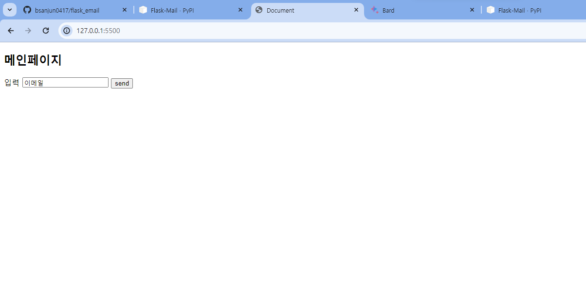
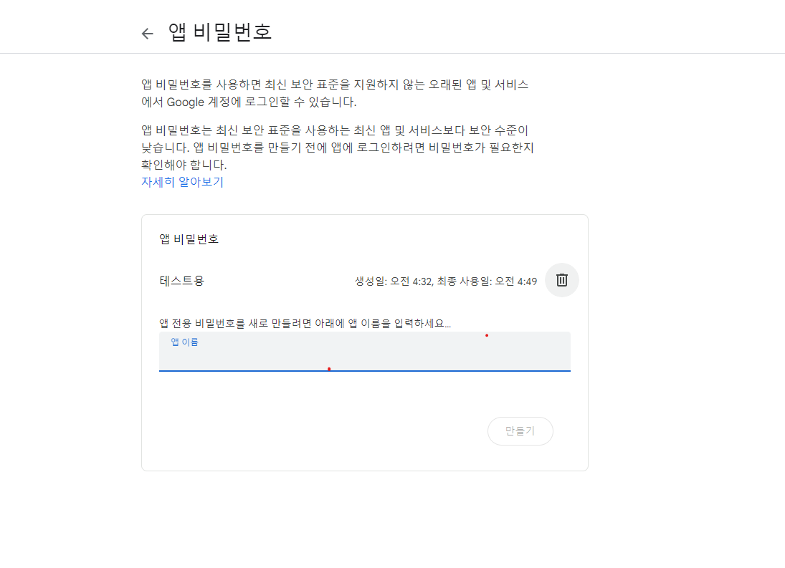

#### 플라스크 서버에서 이메일 전송하는 방법 

> flask-mail 사용
#### pip install Flask-Mail
설치pypi [click](https://pypi.org/project/Flask-Mail/)


##### input창에 이메일을 입력하고 send를 누르면 flask에 설정한 대로 이메일이 전송된다

```python
app.config['MAIL_SERVER'] = 'smtp.gmail.com'
app.config['MAIL_PORT'] = 587
app.config['MAIL_USERNAME'] = '내가 쓸 이메일 주소를 입력'
app.config['MAIL_PASSWORD'] = 'ewau rsfv dweu scdh'
app.config['MAIL_USE_TLS'] = True
app.config['MAIL_USE_SSL'] = False
```

##### TLS와SSL은 구글 이메일 서버에 통신을 하는 방법인듯 하다
```python
## 메일 포트는 587 =TLS ,  465 = SSL
app.config['MAIL_PORT'] = 587
app.config['MAIL_USE_TLS'] = True #어느 포트를 사용할지 선택
app.config['MAIL_USE_SSL'] = False 
```

#### 587은 tls암호화를 사용하는 포트 번호
#### 465은 ssl 암호화를 사용하는 smtp포트 번호
#### 일반적으로 tls가 더 강화된 암호화 방식이다  

```python
app.config['MAIL_PASSWORD'] = 'ewau rsfv dweu scdh'
```
#### 비밀번호는 기본적으로 계정 생성할때 쓰는 일반적인 비번 말고 아래 이미지와 같이 따로 설정해야 된다



```python
    msg = Message('제목', sender='내 이메일 주소', recipients=['보낼 이메일 주소'])
    msg.body = '이메일 내용'
    mail.send(msg)
```
#### 위에 코드 같이 짜면 이메일이 전송된다